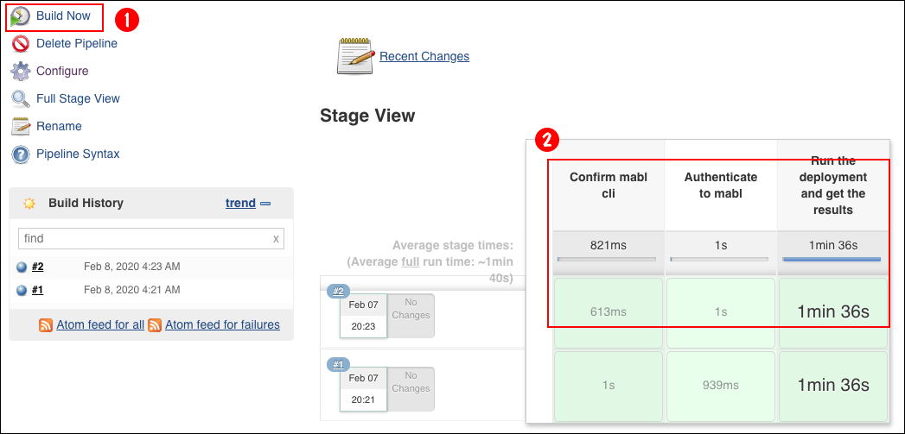

# Creating a CI/CD Pipeline using mablJenkins

The purpose of this exercise is to demonstrate how to implement a CI/CD
pipeline under `mablJenkins` that runs tests created in `mabl` and runs them using the `mabl cli` tool on mabl Cloud

This document assumes that you have followed the steps for getting mablJenkins up and running as
described in this page [here](README.md).

## Creating a sample Plan with Tests in the `mabl` web interface
Before you can run tests in mabl under a pipeline job in Jenkins you need to have an account on [mabl](https://www.mabl.com). Then, once you've created an account for yourself, you need to create one or many tests using the mabl website.

The following video gives you an overview about how to create tests under mabl. Click the image below to view an overview video. It's only a minute and half.

[](https://www.youtube.com/watch?v=pbM8nXYEclM)

Assuming you've viewed the video, let's now go into the step-by-step instructions that show you how to create a test against examples on the mabl [sandbox web site](https://sandbox.mabl.com/).


### Creating a test


### Adding the test to a plan


### Understanding a mabl Deployment

UNDER DEVELOPMENT

### Getting tokens and identifiers from mabl


## Creating a Pipeline Job in Jenkins


### Setting up the `mabl Pipeline Test` job in Jenkins

**Step 1:** Create a job by clicking on the `create new job` link as shown in the figure below.


**Step 2:** Enter the job name, in this case `mabl test` (1). Then select `Pipeline` from the types of jobs lists (2). Finally, click the OK, button on the lower left of the web page, as shown in the figure below (3).


**Step 3:** You'll be taken to the job configuration page. Enter a short `Description` about the job as 
shown in the figure below.


**Step 4:** Select the `Poll SCM` option in the `Build Triggers` section. Then enter a polling
 interval, for example `H/10 * * * *` as shown in the figure below.


The interval statement,`H/10 * * * *` indicates that the GitHub repo will be polled every 10 minutes.

**Step 5:** Save the job

### Adding the access and environment information to Jenkins as secrets

In order to run a Jenkins Pipeline job using the mabl CLI tool you need to store within Jenkins two pieces of information that are particular to your mabl account. The first piece of information is your access token. The second piece of information is the enviornment ID that is special to your mabl instance.

This information is sensitive so you're going to store each piece as a Jenkins secret. The following steps show you how to create the secrets.

**Step 1:** Accessing the credentials page.

Go to the Jenkins main page by clicking the Jenkins logo in the upper right corner as shown in the figure below.


Click the `Credentials` link from the items listed on the left side of the page (1). The page will show the **Stores scoped to Jenkins** section will appear on the right side.


Click the link, **Global credentials (unrestricted)** that appears on the left side of the page, as shown in the figure below.


**Step 2:** Creating global credentials

Click on the link, `Global credential (unrestricted)` as shown in the figure below.


**Step 3:** Click the link, `Add Credentials` that appears on the left of the page.


**Step 4:** Select `Secret text`

Once you select `Add Credential` you'll be presented with a page that contains dropdown lists and textboxes. In the top most list labeled, **Kind:** select `Secret text` as shown in the figure below.


**Step 5:** Add the `mabl_access_token` secret

Click the link, **Add Credentials** on the left side of the Jenkins page.

Select `Global (Jenkins, nodes, items. all child items, etc)` from the dropdown (1).

Enter the value for the **mabl access token** that you've retreived from your account on the mabl web site in the textbox labeled, `Secret`. (2)

Enter a unique id for this secret in the textbox labeled,`ID` (3). In this case you'll see in the figure below that the string assigned to the ID is `mabl_access_token`.

Once all the data is entered, click the `OK` button beneath the data entry fields (4).


**Step 6:** Add the `mabl_environment_ID` secret

Click the link, **Add Credentials** on the left side of the Jenkins page.


Select `Global (Jenkins, nodes, items. all child items, etc)` from the dropdown (1).


Enter the value for the mabl **environment id** that you've retreived from your account on the mabl web site in the textbox labeled, `Secret`. (2)

Enter a unique id for this secret in the textbox labeled,`ID` (3). In this case you'll see in the figure below that the string assigned to the ID is `mabl_evironment_id`.

Once all the data is entered, click the `OK` button beneath the data entry fields (4).


Congratulations! You've created the two secrets you'll need to configure a Jenkins Pipeline job that uses the mabl CLI tool.


### Creating the Pipleline Script

**Step 1:** Go back to the job

Click the Jenkins logo at the top of the page (1). Then click the link for the **mabl Pipeline Test** located on the right side of the page.


**Step 2:** Click the `Configure` link

You're now going to configure the actual script for the pipeline job in Jenkins. Click the `Configure` link on the left hand side of the job page.


**Step 3:** Configure the pipeline script

Scroll down to the Pipeline section as shown in the figure below.


Enter the following script in the section, `Pipeline` as shown at the callout (1) in the figure above.

```
withCredentials([string(credentialsId: 'mabl_access_token', variable: 'mabl_access_token'), string(credentialsId: 'mabl_environment_id', variable: 'mabl_environment_id')]) {
  node {
    stage("Confirm mabl cli"){
        sh 'mabl --version'
    }
    stage("Authenticate to mabl"){
        sh 'mabl auth activate-key ${mabl_access_token}'
    }
    stage("Run the deployment and get the results"){
        sh 'mabl deployments create -e ${mabl_environment_id} --await-completion | grep "Tests complete with status"'
    }
  }
}
```


Then save the job by clicking the `Save` button as shown at callout (2) in the figure above.

**Step 4:**  Start the Pipeline job.

You start the Pipeline job by clicking the link, `Build now` as shown at callout (1) on the left side of the figure below.
 
You can view the progress as shown at callout (2) and then watch the outcome as shown in the figure below.




Congratulations! You've create a Jenkins Pipeline job that runs tests hosted on mabl.