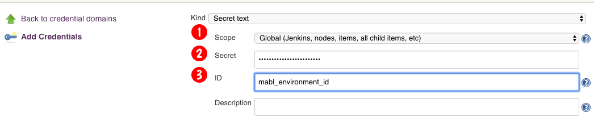
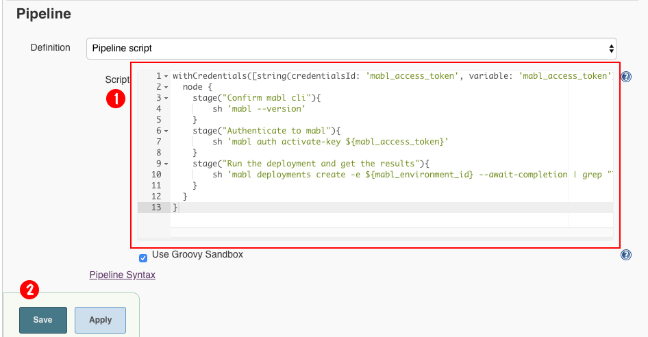

# Creating a CI/CD Pipeline using mablJenkins

The purpose of this exercise is to demonstrate how to implement a CI/CD
pipeline under `mablJenkins` that runs tests created in `mabl` and runs them using the `mabl cli` tool on mabl Cloud

This document assumes that you have followed the steps for getting mablJenkins up and running as
described in this page [here](README.md).

## Creating a sample Plan with Tests in the `mabl` web interface


## Creating a Pipe Job in Jenkins

### Creating the mabl Test Project

**Step 1:** Create a job by clicking on the `create new job` link as shown in the figure below.


**Step 2:** Enter the job name, in this case `mabl test`. Then select `Pipeline` from the types of jobs lists. 
Finally, click the OK, button on the lower left of the web page, as shown in the figure below.


**Step 3:** You'll be taken to the job configuration page. Enter a short `Description` about the job as 
shown in the figure below.


**Step 4:** Select the `Poll SCM` option in the `Build Triggers` section. Then enter a polling
 interval, for example `H/10 * * * *` as shown in the figure below.


The interval statement,`H/10 * * * *` indicates that the GitHub repo will be polled every 10 minutes.

### Adding the access and environment information to Jenkins as secrets

**Step xx:**


**Step xx:**


**Step xx:**


**Step xx:**


**Step xx:**


**Step xx:**


**Step xx:**


### Creating the Pipleline Script

**Step 1:** Go back to the job


**Step 2:** Click the `Configure` link


**Step 3:** Scroll down to the Pipleline section.



Enter the following script in the section, `Pipeline` as shown at the callout (1) in the figure that follows the code.

```
withCredentials([string(credentialsId: 'mabl_access_token', variable: 'mabl_access_token'), string(credentialsId: 'mabl_environment_id', variable: 'mabl_environment_id')]) {
  node {
    stage("Confirm mabl cli"){
        sh 'mabl --version'
    }
    stage("Authenticate to mabl"){
        sh 'mabl auth activate-key ${mabl_access_token}'
    }
    stage("Run the deployment and get the results"){
        sh 'mabl deployments create -e ${mabl_environment_id} --await-completion | grep "Tests complete with status"'
    }
  }
}
```


Then save the job by clicking the `Save` button as shown at callout (2) in the figure above.

**Step 4:**  Start the Pipeline job.

You start the Pipeline job by clicking the link, `Build now` as shown at callout (1) on the left side of the figure below.
 
You can view the progress as shown at callout (2) and then watch the outcome as shown at callout (3)
 in the figure below.


**EXERCISE COMPLETE**